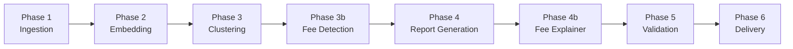
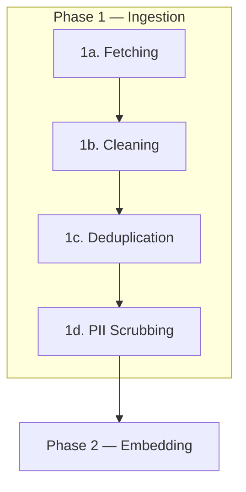
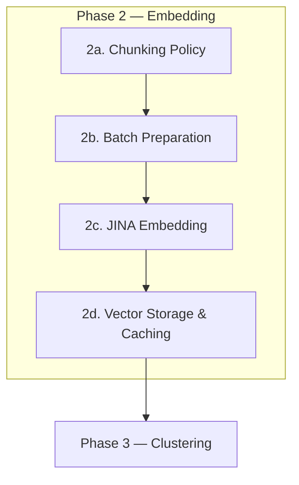
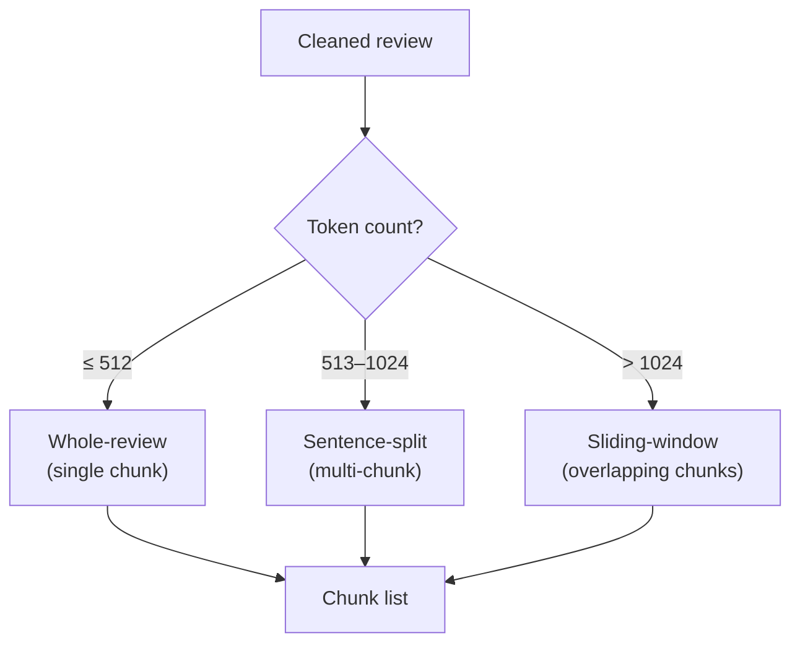
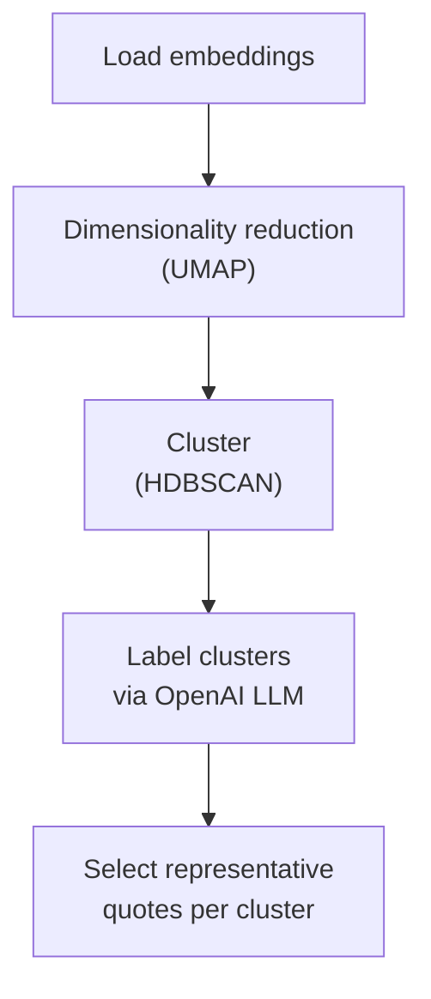
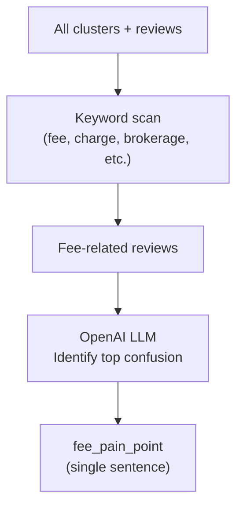
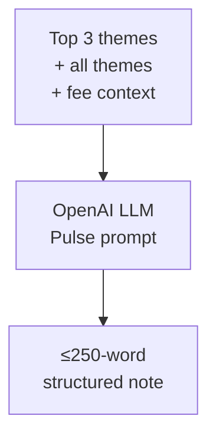
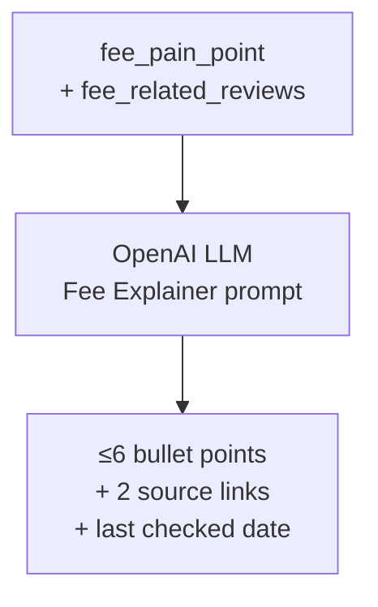
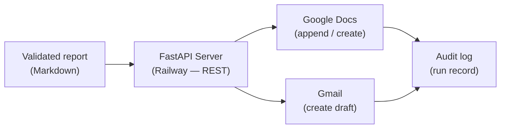
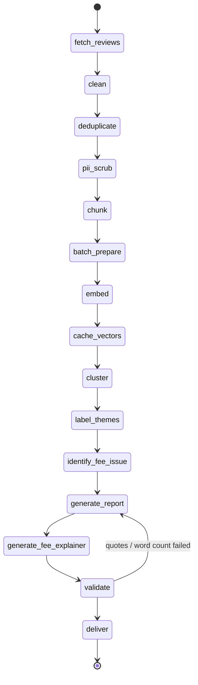

# Architecture — Groww Weekly Review Pulse

This document describes the end-to-end system architecture for the AI-powered weekly review pulse agent. The system fetches public Google Play reviews for **Groww** via the **Google Play Developer API**, clusters them into themes using **JINA Embeddings**, generates insight reports via **OpenAI**, and delivers them through **Google Workspace** — all orchestrated by **LangGraph**.

---

## High-Level Pipeline



| Phase | Purpose | Key Technology |
|---|---|---|
| 1 — Ingestion | Fetch, clean, deduplicate reviews | Google Play Developer API (v3) |
| 2 — Embedding | Vectorise cleaned reviews | JINA Embeddings API |
| 3 — Clustering | Group reviews into ≤5 themes, rank top 3 | HDBSCAN / K-Means |
| 3b — Fee Detection | Identify recurring fee/charge confusion | Keyword matching + OpenAI |
| 4 — Report Generation | Produce ≤250-word weekly pulse note | OpenAI (LLM) |
| 4b — Fee Explainer | Generate fee explanation from identified confusion | OpenAI (LLM) |
| 5 — Validation | Verify quotes, word count, structure | Fuzzy matching |
| 6 — Delivery | Export to Google Docs / Gmail | MCP Server (Railway) → Google Workspace |

---

## Phase 1 — Ingestion (Sub-Phases)

The ingestion phase is decomposed into four sequential sub-phases to keep each step testable and auditable.



### 1a. Fetching (Google Play Developer API)

| Attribute | Detail |
|---|---|
| **Source** | Google Play Developer API — Android Publisher v3 |
| **Endpoint** | `GET androidpublisher/v3/applications/{packageName}/reviews` |
| **Package name** | `com.nextbillion.groww` |
| **Auth** | OAuth 2.0 service account with Google Play Console access |
| **Window** | Rolling 8 weeks from run date |
| **Target volume** | ~5 000 reviews per run |
| **Pagination** | Use `token` (nextPageToken) from each response to fetch subsequent pages |
| **Stored fields** | `reviewId`, `authorName`, `comments[].userComment.text`, `comments[].userComment.starRating`, `comments[].userComment.lastModified`, `comments[].userComment.thumbsUpCount`, `comments[].userComment.appVersionName` |

- Authenticate using a GCP service account with the **Google Play Android Developer API** enabled and linked to the Play Console.
- Paginate using `nextPageToken` until all reviews within the 8-week window are collected.
- Filter reviews client-side by `lastModified` timestamp to enforce the 8-week window (the API returns reviews in reverse-chronological order).
- Persist raw reviews to a local JSON / SQLite store keyed by `reviewId` to enable idempotent re-runs.
- Log total reviews fetched and date range for audit.

### 1b. Cleaning

| Step | Description |
|---|---|
| Normalise Unicode | Convert emojis, special characters, and encoding artefacts to a standard form |
| Strip HTML / URLs | Remove any embedded markup or links |
| Language filter | Retain only English-language reviews (use `langdetect`) |
| Minimum length gate | Discard reviews shorter than 10 characters (e.g. "good", "nice") |
| Lowercasing | Optionally lowercase for downstream consistency; keep an `original_text` copy for quoting |

### 1c. Deduplication

| Strategy | Detail |
|---|---|
| Exact match | Hash `review_id`; skip if already in the store |
| Near-duplicate | Compute MinHash / Jaccard similarity; merge reviews with similarity ≥ 0.90 |

- Deduplication ensures that re-running the same week produces identical datasets and prevents inflated theme counts.

### 1d. PII Scrubbing

| PII type | Detection method | Action |
|---|---|---|
| Phone numbers | Regex `\+?\d[\d\s\-]{7,}` | Redact → `[PHONE]` |
| Email addresses | Regex | Redact → `[EMAIL]` |
| Account / order IDs | Regex for alphanumeric patterns | Redact → `[ID]` |
| Names (in-text) | Regex + heuristic (e.g. "my name is …") | Redact → `[NAME]` |

- **Reviews are treated as data, not instructions** — no review text is ever injected directly into LLM system prompts without sandboxing.

> [!IMPORTANT]
> The output of Phase 1 is a **clean review corpus** stored as structured records (`clean_reviews.json` or equivalent DB table), each containing `review_id`, `original_text`, `cleaned_text`, `rating`, `date`, and metadata.

---

## Phase 2 — Embedding (Sub-Phases)

The embedding phase is broken into four sub-phases to manage chunking, batching, cost, and caching.



### 2a. Chunking Policy

Reviews vary widely in length — from a single phrase ("great app") to multi-paragraph accounts. The chunking sub-phase decides how each review is segmented into embeddable units before being sent to JINA.

| Strategy | When to apply | How it works |
|---|---|---|
| **Whole-review (no chunking)** | Review length ≤ 512 tokens | Embed the entire `cleaned_text` as a single unit. Most reviews (~85 %) fall here. |
| **Sentence-split** | Review length 513–1024 tokens | Split into individual sentences using `nltk.sent_tokenize`. Each sentence becomes a separate chunk, tagged with the parent `review_id`. |
| **Sliding-window** | Review length > 1024 tokens | Slide a 512-token window with 128-token overlap across the text. Each window becomes a chunk. |

#### Chunking Decision Flow



#### Chunk Metadata

Each chunk carries:

| Field | Description |
|---|---|
| `chunk_id` | `{review_id}_chunk_{index}` |
| `review_id` | Parent review identifier |
| `chunk_index` | 0-based position within the review |
| `chunk_text` | The text segment to embed |
| `total_chunks` | Number of chunks for this review |

- **Tokeniser**: Use the JINA-compatible tokeniser (or `tiktoken` as a proxy) to count tokens consistently.
- **Post-clustering reassembly**: During clustering, chunks are grouped back to their parent `review_id` so that a single review is not counted as multiple data points in theme frequency.

### 2b. Batch Preparation

| Attribute | Detail |
|---|---|
| **Input** | Chunks from Phase 2a |
| **Text field** | `chunk_text` |
| **Batch size** | 256 reviews per API call (JINA recommended) |
| **Pre-check** | Skip chunks whose `chunk_id` already has a cached embedding |

- Build batches of chunk texts, ordering by `chunk_id` for reproducibility.
- Attach metadata (`chunk_id`, `review_id`, `rating`, `date`) alongside each text for post-embedding join.

### 2c. JINA Embedding

| Attribute | Detail |
|---|---|
| **Provider** | [JINA Embeddings API](https://jina.ai/embeddings/) |
| **Model** | `jina-embeddings-v3` (or latest stable) |
| **Dimensions** | 1024 (default) |
| **Input type** | `passage` (for review texts) |
| **Rate limiting** | Respect API rate limits; implement exponential backoff |

- Call JINA `/v1/embeddings` endpoint per batch.
- Each response returns a list of float vectors aligned 1:1 with the input texts.
- Handle transient errors with retry (max 3 retries, exponential backoff).

### 2d. Vector Storage & Caching

| Attribute | Detail |
|---|---|
| **Storage** | Local NumPy `.npy` file or ChromaDB collection |
| **Key** | `chunk_id` |
| **Metadata stored** | `chunk_id`, `review_id`, `rating`, `date`, `original_text`, `cleaned_text`, `chunk_index` |
| **Cache policy** | If a `chunk_id` already has a stored embedding, skip re-embedding |

- Persist embeddings to disk so that re-runs for the same week do not re-call the JINA API.
- On each run, only compute embeddings for **new** reviews not yet in the cache.

> [!IMPORTANT]
> The output of Phase 2 is an **embedding matrix** of shape `(N, 1024)` with aligned metadata, ready for clustering.

---

## Phase 3 — Clustering & Theme Extraction



| Step | Detail |
|---|---|
| **Dimensionality reduction** | UMAP to 10–20 dimensions for clustering stability |
| **Clustering algorithm** | HDBSCAN (`min_cluster_size=30`, `min_samples=5`) — automatically determines cluster count and identifies noise/outlier reviews |
| **Fallback** | If HDBSCAN produces < 3 clusters, retry with K-Means (k = 5–8) |
| **Cluster cap** | Maximum 5 clusters. If HDBSCAN produces >5, merge smallest clusters into an "Other Themes" bucket |
| **Top 3 ranking** | Sort clusters by review count (descending); mark top 3 with `is_top_3 = True` |
| **Cluster labelling** | For each cluster, sample 15–20 reviews and send to **OpenAI** with a prompt: *"Summarise the common theme in these user reviews in ≤ 10 words."* |
| **Quote selection** | For each cluster, pick 2–3 reviews closest to the cluster centroid as **representative quotes** |

### Noise / Outlier Handling

- Reviews tagged as noise by HDBSCAN are grouped into a catch-all "Other" bucket.
- If the noise bucket exceeds 20 % of total reviews, re-cluster with relaxed parameters.

---

## Phase 3b — Fee/Charge Pain Point Detection



| Step | Detail |
|---|---|
| **Keyword scan** | Scan all reviews across clusters for fee-related keywords (~40 terms: fee, charge, brokerage, deduction, hidden, GST, STT, DP charges, etc.) |
| **LLM identification** | Sample up to 30 fee-related reviews, ask OpenAI: *"What is the single most recurring fee/charge confusion or pain point?"* |
| **Output** | `fee_pain_point` (single sentence, ≤30 words) + `fee_related_reviews` (list of matching reviews) |

---

## Phase 4 — Report Generation (≤250-Word Weekly Pulse)



| Attribute | Detail |
|---|---|
| **LLM provider** | **OpenAI** |
| **Model** | `gpt-oss-120b` (or latest available on OpenAI) |
| **Integration** | `langchain-openai` — `ChatOpenAI` class |
| **Temperature** | 0.3 (factual, low-creativity) |
| **Max tokens** | 2048 |
| **Word limit** | ≤250 words (enforced in prompt + validated post-generation) |

### Prompt Design

The report generation prompt produces a **≤250-word structured weekly note** with:

```
System: You are a product analyst. Generate a concise weekly review pulse note.
         STRICT: The ENTIRE note must be ≤250 words.
         Do NOT invent quotes — only use quotes provided in the data below.
         Use exactly 3 real user quotes total.

User:
  Product: Groww
  Review period: {start_date} to {end_date}
  Total reviews processed: {count}

  Top 3 Themes: {top_3_themes}
  All Themes: {all_themes}
  Fee confusion: {fee_pain_point}

  Generate:
  1. ## Summary of Top Themes — 2-3 sentences on top 3 themes
  2. ## Supporting User Quotes — exactly 3 real quotes (blockquotes)
  3. ## Key Observation — what’s going wrong / trending (1-2 sentences)
  4. ## Action Ideas — exactly 3 actionable suggestions (numbered)
```

- The prompt treats review data as **structured input**, not as free-form instructions, to prevent prompt-injection from review text.
- OpenAI returns the report as structured Markdown.

---

## Phase 4b — Fee Explainer



Using the confusion identified in Phase 3b, generate a structured explanation:

| Attribute | Detail |
|---|---|
| **Bullet points** | ≤6, explaining the fee clearly |
| **Tone** | Neutral, facts-only — no marketing language |
| **Source links** | 2 official sources (Groww support, SEBI, NSE/BSE) |
| **Freshness** | Appends "Last checked: {today’s date}" |
| **Connection** | Directly derived from user confusion in reviews (not generic) |

- The prompt treats review data as **structured input**, not as free-form instructions, to prevent prompt-injection from review text.
- OpenAI returns the report as structured Markdown.

---

## Phase 5 — Validation

| Check | Method | Action on failure |
|---|---|
| **Quote authenticity** | Fuzzy-match every quote in the report against `original_text` in the review corpus (threshold ≥ 0.85 via `rapidfuzz`) | Remove or flag hallucinated quotes; regenerate section if > 50 % fail |
| **Theme coverage** | Verify each cluster with ≥ 30 reviews is represented in the report | Re-prompt OpenAI for missing themes |
| **Formatting** | Validate Markdown structure: Summary of Top Themes, Supporting User Quotes, Key Observation, Action Ideas | Auto-fix via regex |
| **Word count** | Verify report is ≤250 words | Flag for retry |
| **Idempotency** | Hash `(product, week_start, week_end)` — check if a report for this key already exists | Skip generation; return existing report |

---

## Phase 6 — Delivery (via REST API)

The delivery phase uses a **custom FastAPI server deployed on Railway** to handle Google Docs and Gmail operations. The server has OAuth credentials and token configuration embedded, so the pipeline only needs the base server URL to connect. Communication uses plain **HTTP POST** (JSON over HTTPS) — no SSE or MCP protocol overhead.



| Channel | Detail |
|---|---|
| **Google Docs** | Append report content to a Google Doc titled `Groww — Weekly Pulse — {week}` via `POST /append_to_doc` (OAuth embedded in server) |
| **Gmail** | Create an email draft for configured recipients via `POST /create_email_draft` (OAuth embedded in server) |
| **Transport** | Plain HTTPS JSON — `MCP_SERVER_URL` is the base URL (no `/sse` suffix) |
| **Duplicate prevention** | Before creating a Doc or sending an email, query the audit log for an existing run with the same `(product, week)` key |

---

## LangGraph Orchestration

The entire pipeline is orchestrated as a **LangGraph StateGraph** with typed state.



### State Schema

```python
from typing import TypedDict, Optional

class PipelineState(TypedDict):
    # Inputs
    product: str                    # "Groww"
    week_start: str                 # ISO date
    week_end: str                   # ISO date

    # Phase 1 — Ingestion
    raw_reviews: list[dict]         # fetched reviews from Google Play API
    cleaned_reviews: list[dict]     # after clean + dedup + PII scrub

    # Phase 2 — Embedding
    chunks: list[dict]              # chunked review segments
    embeddings: list[list[float]]   # JINA embedding vectors
    embedding_ids: list[str]        # aligned chunk_ids

    # Phase 3 — Clustering
    clusters: list[dict]            # {label, review_ids, centroid_quotes, is_top_3, rank}
    noise_reviews: list[dict]       # outlier reviews

    # Phase 3b — Fee Detection
    fee_pain_point: str             # identified fee/charge confusion
    fee_related_reviews: list[dict] # reviews mentioning fees

    # Phase 4 — Report
    report_markdown: str            # generated ≤250-word pulse note

    # Phase 4b — Fee Explainer
    fee_explainer: str              # ≤6 bullet explanation

    # Phase 5 — Validation
    validation_passed: bool
    validation_errors: list[str]

    # Phase 6 — Delivery
    doc_url: Optional[str]          # Google Doc link
    email_sent: bool
    audit_record: dict              # full run metadata
```

### Node Definitions

Each node is a Python function that receives the current `PipelineState` and returns a partial state update:

| Node | Input keys | Output keys |
|---|---|---|
| `fetch_reviews` | `product`, `week_start`, `week_end` | `raw_reviews` |
| `clean` | `raw_reviews` | `cleaned_reviews` (partial) |
| `deduplicate` | `cleaned_reviews` | `cleaned_reviews` (final) |
| `pii_scrub` | `cleaned_reviews` | `cleaned_reviews` (scrubbed) |
| `chunk` | `cleaned_reviews` | `chunks` |
| `batch_prepare` | `chunks` | (internal batches) |
| `embed` | batches | `embeddings`, `embedding_ids` |
| `cache_vectors` | `embeddings`, `embedding_ids` | (persisted to disk) |
| `cluster` | `embeddings` | `clusters` (≤5, ranked), `noise_reviews` |
| `label_themes` | `clusters` | `clusters` (with labels) |
| `identify_fee_issue` | `clusters`, `cleaned_reviews` | `fee_pain_point`, `fee_related_reviews` |
| `generate_report` | `clusters`, `fee_pain_point`, metadata | `report_markdown` (≤250 words) |
| `generate_fee_explainer` | `fee_pain_point`, `fee_related_reviews` | `fee_explainer` |
| `validate` | `report_markdown`, `cleaned_reviews` | `validation_passed`, `validation_errors` |
| `deliver` | `report_markdown`, `fee_explainer` | `doc_url`, `email_sent`, `audit_record` |

### Conditional Edges

```python
def should_retry_report(state):
    if not state["validation_passed"]:
        return "generate_report"   # loop back
    return "deliver"

graph.add_conditional_edges("validate", should_retry_report)
```

- Maximum 2 retry loops before the pipeline raises a validation failure alert.

---

## Idempotency & Auditability

| Concern | Mechanism |
|---|---|
| **No duplicate reports** | Composite key `(product, week_start, week_end)` checked before generation and delivery |
| **No duplicate emails** | Audit log records `email_sent = True`; delivery node skips if already sent |
| **Backfill support** | Run with a custom `week_start` / `week_end` to generate historical reports |
| **Audit record** | Every run persists: product, review window, review count, report content, doc URL, email status, timestamps |

---

## Technology Stack Summary

| Layer | Technology |
|---|---|
| **Orchestration** | LangGraph (StateGraph) |
| **LLM** | OpenAI (`gpt-oss-120b`) via `langchain-openai` |
| **Embeddings** | JINA Embeddings API (`jina-embeddings-v3`) |
| **Review fetching** | Google Play Developer API v3 (`androidpublisher`) |
| **Clustering** | UMAP + HDBSCAN (fallback: K-Means) |
| **Quote validation** | `rapidfuzz` (fuzzy string matching) |
| **Vector cache** | NumPy `.npy` / ChromaDB |
| **Delivery** | FastAPI server (Railway, REST/HTTPS) — `POST /append_to_doc`, `POST /create_email_draft` → Google Docs + Gmail |
| **Language** | Python 3.11+ |
| **Scheduling** | Cron / Cloud Scheduler / APScheduler |

---

## Directory Structure (Proposed)

```
Reviews_Based_agent/
├── docs/
│   ├── problemStatement.md
│   └── architecture.md
├── src/
│   ├── main.py                  # Entry point / CLI
│   ├── graph.py                 # LangGraph pipeline definition
│   ├── nodes/
│   │   ├── fetch_reviews.py     # Phase 1a — Fetching (Google Play API)
│   │   ├── clean.py             # Phase 1b — Cleaning
│   │   ├── deduplicate.py       # Phase 1c — Deduplication
│   │   ├── pii_scrub.py         # Phase 1d — PII Scrubbing
│   │   ├── chunk.py             # Phase 2a — Chunking Policy
│   │   ├── batch_prepare.py     # Phase 2b — Batch Preparation
│   │   ├── embed.py             # Phase 2c — JINA Embedding
│   │   ├── cache_vectors.py     # Phase 2d — Vector Storage
│   │   ├── cluster.py           # Phase 3 — Clustering
│   │   ├── label_themes.py      # Phase 3 — Theme Labelling
│   │   ├── generate_report.py   # Phase 4 — Report Generation
│   │   ├── validate.py          # Phase 5 — Validation
│   │   └── deliver.py           # Phase 6 — Delivery (via MCP)
│   ├── mcp_client.py            # REST client (httpx → Railway FastAPI server)
│   ├── state.py                 # PipelineState TypedDict
│   └── config.py                # API keys, constants
├── data/
│   ├── raw/                     # Raw fetched reviews
│   ├── clean/                   # Cleaned review corpus
│   ├── embeddings/              # Cached JINA embeddings
│   └── reports/                 # Generated reports
├── tests/
├── requirements.txt
└── .env                         # OPENAI_API_KEY, JINA_API_KEY, MCP_SERVER_URL
```
