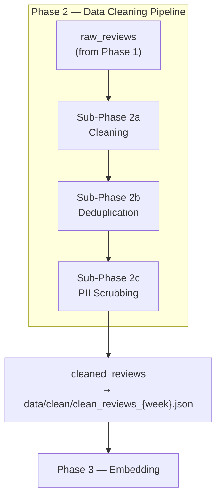
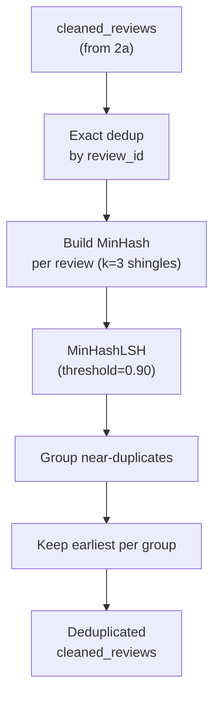
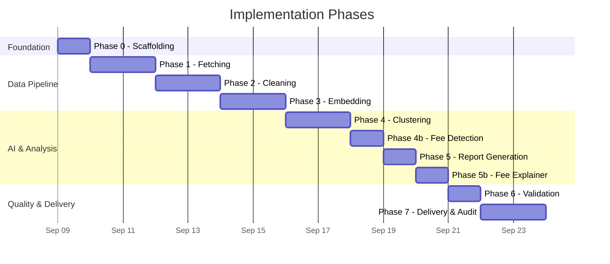

# Groww Weekly Review Pulse — Phased Implementation Plan

This plan breaks the [architecture.md](file:///d:/nextleap/Reviews_Based_agent/docs/architecture.md) into **8 implementation phases**, ordered by dependency. Each phase is self-contained, testable, and produces a working increment.

---

## Phase 0 — Project Scaffolding & Configuration

> Set up the project skeleton, dependency management, environment configuration, and the LangGraph state definition so every subsequent phase plugs into a working harness.

### [NEW] `requirements.txt`
Python dependencies:

```
# Orchestration
langgraph>=0.2.0
langchain-core>=0.3.0
langchain-openai>=0.3.0

# Review fetching
google-api-python-client>=2.100.0
google-auth>=2.20.0
google-auth-oauthlib>=1.0.0

# Cleaning & NLP
langdetect>=1.0.9
nltk>=3.8.0
tiktoken>=0.7.0

# Embedding
requests>=2.31.0

# Clustering
numpy>=1.26.0
umap-learn>=0.5.4
hdbscan>=0.8.33
scikit-learn>=1.3.0

# Validation
rapidfuzz>=3.5.0

# Delivery (MCP server on Railway — handles Google Docs + Gmail)
mcp[cli]>=1.0.0

# Utilities
python-dotenv>=1.0.0
```

### [NEW] `.env.example`
Template for required environment variables:

```
OPENAI_API_KEY=
JINA_API_KEY=
GOOGLE_PLAY_PACKAGE_NAME=com.nextbillion.groww
MCP_SERVER_URL=https://your-app.railway.app/sse
REPORT_RECIPIENTS=team@example.com
# MCP_SERVER_TIMEOUT=60
```

### [NEW] `src/config.py`
- Load environment variables via `python-dotenv`.
- Define constants: `REVIEW_WINDOW_WEEKS = 8`, `JINA_BATCH_SIZE = 256`, `JINA_MODEL = "jina-embeddings-v3"`, `OPENAI_MODEL = "gpt-oss-120b"`, `OPENAI_TEMPERATURE = 0.3`, `OPENAI_MAX_TOKENS = 2048`, `MIN_REVIEW_LENGTH = 10`, `NEAR_DUPLICATE_THRESHOLD = 0.90`, `FUZZY_MATCH_THRESHOLD = 0.85`, `HDBSCAN_MIN_CLUSTER_SIZE = 30`, `HDBSCAN_MIN_SAMPLES = 5`.
- MCP server config: `MCP_SERVER_URL` (Railway deployment URL), `MCP_SERVER_TIMEOUT = 60`.

### [NEW] `src/state.py`
- Define `PipelineState(TypedDict)` exactly as specified in the architecture (lines 320–350).

### [NEW] `src/graph.py` (skeleton)
- Import all node functions (stubs initially).
- Build `StateGraph(PipelineState)` with nodes and edges (including the conditional `validate → generate_report` retry edge).
- Export a compiled `app` graph.

### [NEW] `src/main.py`
- CLI entry point using `argparse`: accepts `--product`, `--week-start`, `--week-end`, `--backfill`.
- Invokes the compiled LangGraph with initial state.

### [NEW] Directory structure
```
src/nodes/         # empty __init__.py
data/raw/
data/clean/
data/embeddings/
data/reports/
tests/
```

#### Verification
- `python src/main.py --help` runs without error.
- All imports resolve (node functions are stubs returning `{}`).

---

## Phase 1 — Review Ingestion (Architecture Phase 1a: Fetching)

> Fetch public Google Play reviews for Groww using the `google-play-scraper` library. This approach requires **no API credentials or Play Console access** — it scrapes publicly available review data.

> [!NOTE]
> The architecture specifies the Google Play Developer API (v3), which requires a GCP service account linked to the Play Console. Since we don't have Play Console access for Groww, we use `google-play-scraper` as a drop-in alternative that returns the same fields. The pipeline can be switched to the official API later by replacing only this node.

### [NEW] `src/nodes/fetch_reviews.py`

| Concern | Implementation |
|---|---|
| **Library** | `google-play-scraper` — scrapes public Google Play Store reviews without authentication. |
| **API call** | `google_play_scraper.reviews(app_id, lang, country, sort, count, filter_score_with)` → returns list of review dicts. |
| **Package name** | `com.nextbillion.groww` (from `config.GOOGLE_PLAY_PACKAGE_NAME`) |
| **Target volume** | ~5,000 reviews per run (fetched via `reviews_all()` or batched `reviews()` with `continuation_token`) |
| **Date filtering** | Client-side filter: keep reviews where `at` (datetime) ≥ `week_start`. The library returns reviews in reverse-chronological order. |
| **Pagination** | Use `continuation_token` returned by `reviews()` to fetch subsequent batches of 200 reviews until the date window is exhausted. |
| **Persistence** | Write raw reviews to `data/raw/reviews_{week_start}.json`, keyed by `reviewId` for idempotent re-runs. |
| **Idempotency** | Before fetching, check if `data/raw/reviews_{week_start}.json` already exists; if so, load from disk and skip API call. |
| **Output** | Returns `{"raw_reviews": [...]}` — list of dicts with fields: `review_id`, `author_name`, `text`, `star_rating`, `date`, `thumbs_up_count`, `app_version`. |
| **Logging** | Log total fetched count, date range, and any scraping errors. |

#### Field Mapping

| `google-play-scraper` field | Mapped to | Description |
|---|---|---|
| `reviewId` | `review_id` | Unique review identifier |
| `userName` | `author_name` | Reviewer display name |
| `content` | `text` | Review text body |
| `score` | `star_rating` | 1–5 star rating |
| `at` | `date` | Review datetime (converted to ISO date string) |
| `thumbsUpCount` | `thumbs_up_count` | Helpfulness votes |
| `appVersion` | `app_version` | App version at time of review |

#### Function Signature

```python
def fetch_reviews(state: PipelineState) -> dict:
    """
    Input:  state["product"], state["week_start"], state["week_end"]
    Output: {"raw_reviews": list[dict]}
    
    Side-effect: Persists raw reviews to data/raw/reviews_{week_start}.json
    """
```

#### Edge Cases

- **Rate limiting** — `google-play-scraper` may be throttled by Google; implement `time.sleep(1)` between batches.
- **Fewer reviews than expected** — Groww may have < 5,000 reviews in the 8-week window; log a warning but proceed.
- **Network errors** — Retry up to 3 times with exponential backoff.
- **Re-runs** — If raw file already exists, load from disk (idempotent).

#### Dependencies

```
# requirements.txt
google-play-scraper>=0.0.6.0
```

#### Verification
- Unit test with mocked `google_play_scraper.reviews()` responses.
- Integration test: fetch 10 real reviews for `com.nextbillion.groww` and verify field mapping.

---

## Phase 2 — Data Cleaning Pipeline (Architecture Phases 1b, 1c, 1d)

> Clean, deduplicate, and PII-scrub raw reviews to produce a **clean review corpus**. This phase maps to the three ingestion sub-phases defined in [architecture.md — Phase 1b, 1c, 1d](file:///d:/nextleap/Reviews_Based_agent/docs/architecture.md#L62-L93).

### Data Flow



### Input Contract

| Field | Type | Source |
|---|---|---|
| `raw_reviews` | `list[dict]` | Phase 1 (`fetch_reviews` node) |

Each dict in `raw_reviews` must contain: `review_id`, `author_name`, `text`, `star_rating`, `date`, `thumbs_up_count`, `app_version`.

---

### Sub-Phase 2a — Cleaning

**File**: [NEW] `src/nodes/clean.py`
**Architecture ref**: [1b. Cleaning](file:///d:/nextleap/Reviews_Based_agent/docs/architecture.md#L62-L70)

This sub-phase applies five sequential transformations to each raw review. The order matters — Unicode must be normalised before language detection, and the original text must be preserved before lowercasing.

#### Processing Steps

| # | Step | Implementation | Architecture Ref |
|---|---|---|---|
| 1 | **Unicode normalisation** | `unicodedata.normalize("NFKC", text)` — converts emojis, special characters, and encoding artefacts to standard form. Strip non-printable chars via `re.sub(r'[^\x20-\x7E\n\t]', '', text)` (after NFKC). | _"Convert emojis, special characters, and encoding artefacts to a standard form"_ |
| 2 | **Strip HTML / URLs** | `re.sub(r'<[^>]+>', '', text)` to remove markup; `re.sub(r'https?://\S+', '', text)` to remove links. Also strip `www.` prefixed URLs. | _"Remove any embedded markup or links"_ |
| 3 | **Language filter** | `langdetect.detect(text) == 'en'` — discard non-English reviews. Wrap in try/except since `langdetect` raises `LangDetectException` on empty/ambiguous text (treat as non-English). | _"Retain only English-language reviews (use langdetect)"_ |
| 4 | **Minimum length gate** | `len(cleaned_text.strip()) < MIN_REVIEW_LENGTH` (default 10) → discard. Filters out trivially short reviews like "good", "nice", "👍". | _"Discard reviews shorter than 10 characters"_ |
| 5 | **Lowercasing** | Store `cleaned_text = text.lower()` for downstream consistency. Preserve `original_text` (pre-lowered) for verbatim quoting in the final report. | _"Optionally lowercase; keep an original_text copy for quoting"_ |

#### Function Signature

```python
def clean(state: PipelineState) -> dict:
    """
    Input:  state["raw_reviews"]  — list[dict] from fetch_reviews
    Output: {"cleaned_reviews": list[dict]}  — partially cleaned reviews
    """
```

#### Output Record Schema (per review)

| Field | Type | Description |
|---|---|---|
| `review_id` | `str` | Original review identifier (unchanged) |
| `original_text` | `str` | Text before lowercasing (for quoting) |
| `cleaned_text` | `str` | Lowercased, normalised, stripped text |
| `rating` | `int` | Star rating (1–5) |
| `date` | `str` | ISO date of the review |
| `author_name` | `str` | Reviewer name (passed through) |
| `thumbs_up_count` | `int` | Helpfulness votes |
| `app_version` | `str` | App version at time of review |

#### Edge Cases

- **Emoji-only reviews** → NFKC normalises; length gate discards if < 10 chars after stripping.
- **Mixed-language reviews** → `langdetect` may mis-classify short bilingual text; err on the side of inclusion for reviews > 50 chars.
- **Empty text after stripping** → Discard (caught by length gate).
- **`langdetect` failure** → Wrap in try/except; log warning; discard review.

#### Logging

- Log: total input reviews, reviews discarded per reason (non-English, too short, empty), total output reviews.

---

### Sub-Phase 2b — Deduplication

**File**: [NEW] `src/nodes/deduplicate.py`
**Architecture ref**: [1c. Deduplication](file:///d:/nextleap/Reviews_Based_agent/docs/architecture.md#L72-L79)

This sub-phase applies two tiers of deduplication to prevent inflated theme counts and ensure idempotent re-runs.

#### Deduplication Strategies

| # | Strategy | Method | Threshold | Architecture Ref |
|---|---|---|---|---|
| 1 | **Exact-match** | Build a `set()` of `review_id` values; skip any review whose `review_id` is already in the set. | N/A (exact) | _"Hash review_id; skip if already in the store"_ |
| 2 | **Near-duplicate** | Compute **MinHash** signatures using `datasketch.MinHash` (128 permutations) over word-level shingles (k=3) of `cleaned_text`. Compare all pairs using `datasketch.MinHashLSH` with Jaccard threshold ≥ `NEAR_DUPLICATE_THRESHOLD` (0.90). For each duplicate group, keep the **earliest** review (by `date`). | Jaccard ≥ 0.90 | _"Compute MinHash / Jaccard similarity; merge reviews with similarity ≥ 0.90"_ |

#### Function Signature

```python
def deduplicate(state: PipelineState) -> dict:
    """
    Input:  state["cleaned_reviews"]  — partially cleaned from Sub-Phase 2a
    Output: {"cleaned_reviews": list[dict]}  — deduplicated reviews
    """
```

#### Algorithm Detail



#### Edge Cases

- **Single-word reviews that survived length gate** → MinHash with k=3 shingles may produce degenerate hashes; handle gracefully (treat as unique).
- **Identical text, different `review_id`** → Caught by near-duplicate (Jaccard = 1.0); exact-match won't catch since IDs differ.
- **Re-runs** → Exact dedup on `review_id` ensures idempotency across runs.

#### Logging

- Log: input count, exact duplicates removed, near-duplicate groups found, near-duplicates merged, output count.

---

### Sub-Phase 2c — PII Scrubbing

**File**: [NEW] `src/nodes/pii_scrub.py`
**Architecture ref**: [1d. PII Scrubbing](file:///d:/nextleap/Reviews_Based_agent/docs/architecture.md#L81-L91)

This sub-phase redacts personally identifiable information from both `cleaned_text` and `original_text` before any downstream processing (embedding, LLM). As the architecture states: _"Reviews are treated as data, not instructions."_

#### PII Detection & Redaction Rules

| # | PII Type | Detection Method | Regex Pattern | Replacement | Architecture Ref |
|---|---|---|---|---|---|
| 1 | **Phone numbers** | Regex | `\+?\d[\d\s\-]{7,}` | `[PHONE]` | _"Regex \+?\d[\d\s\-]{7,}"_ |
| 2 | **Email addresses** | Regex | `[a-zA-Z0-9._%+-]+@[a-zA-Z0-9.-]+\.[a-zA-Z]{2,}` | `[EMAIL]` | _"Regex"_ |
| 3 | **Account / Order IDs** | Regex for alphanumeric patterns | `[A-Z]{2,}\d{6,}` | `[ID]` | _"Regex for alphanumeric patterns"_ |
| 4 | **Names (in-text)** | Regex + heuristic | `(?i)(?:my name is|i am|i'm)\s+([A-Z][a-z]+(?:\s+[A-Z][a-z]+)?)` | `[NAME]` | _"Regex + heuristic (e.g. 'my name is …')"_ |

#### Function Signature

```python
def pii_scrub(state: PipelineState) -> dict:
    """
    Input:  state["cleaned_reviews"]  — deduplicated from Sub-Phase 2b
    Output: {"cleaned_reviews": list[dict]}  — PII-scrubbed reviews
    
    Side-effect: Persists final corpus to data/clean/clean_reviews_{week}.json
    """
```

#### Processing Detail

1. Apply PII patterns **in order** (phone → email → IDs → names) to both `cleaned_text` and `original_text`.
2. PII redaction is applied **after** deduplication to avoid MinHash mismatches due to redaction tokens.
3. After scrubbing, persist the final clean corpus to `data/clean/clean_reviews_{week_start}.json`.

#### Edge Cases

- **Indian phone numbers** — patterns like `+91 98765 43210` or `98765-43210` are caught by the phone regex.
- **False positive IDs** — strings like `UPI123456` in review text may be redacted; this is acceptable (errs on the side of caution).
- **PII in `original_text`** — both fields are scrubbed; quotes in the final report will show `[PHONE]` etc.
- **No PII found** — review passes through unchanged; this is the common case.

#### Logging

- Log: total reviews processed, count of redactions per PII type, total reviews with any PII found, output file path.

---

### Phase 2 — Output Contract

> [!IMPORTANT]
> The output of Phase 2 is a **clean review corpus** stored as structured records in `data/clean/clean_reviews_{week_start}.json`, each containing `review_id`, `original_text`, `cleaned_text`, `rating`, `date`, and metadata. This matches the architecture spec exactly ([ref](file:///d:/nextleap/Reviews_Based_agent/docs/architecture.md#L92-L93)).

#### Output File Schema (`clean_reviews_{week_start}.json`)

```json
[
  {
    "review_id": "gp:AOqpTOH...",
    "original_text": "The app freezes exactly when the market opens, very frustrating.",
    "cleaned_text": "the app freezes exactly when the market opens, very frustrating.",
    "rating": 2,
    "date": "2026-08-15",
    "author_name": "User123",
    "thumbs_up_count": 42,
    "app_version": "5.6.1"
  }
]
```

#### Summary Statistics (logged at end of Phase 2)

| Metric | Description |
|---|---|
| `total_raw` | Reviews received from Phase 1 |
| `removed_non_english` | Discarded by language filter |
| `removed_short` | Discarded by minimum length gate |
| `removed_exact_dupes` | Removed by exact `review_id` dedup |
| `removed_near_dupes` | Merged by MinHash near-duplicate detection |
| `pii_redactions` | Total PII redactions applied (broken down by type) |
| `total_clean` | Final clean corpus size |

---

### Phase 2 — Verification Plan

#### Unit Tests

| Test file | Test | Description |
|---|---|---|
| `tests/test_clean.py` | `test_unicode_normalisation` | Verify NFKC normalisation on emoji-heavy and accented text. |
| `tests/test_clean.py` | `test_html_url_stripping` | Verify `<b>bold</b>` and `https://example.com` are removed. |
| `tests/test_clean.py` | `test_language_filter` | Verify Hindi/Spanish reviews are discarded; English retained. |
| `tests/test_clean.py` | `test_min_length_gate` | Verify "good" (4 chars) is discarded; "great application" (17 chars) passes. |
| `tests/test_clean.py` | `test_original_text_preserved` | Verify `original_text` retains pre-lowered casing. |
| `tests/test_clean.py` | `test_langdetect_exception` | Verify empty/ambiguous text is handled gracefully. |
| `tests/test_deduplicate.py` | `test_exact_dedup` | Feed 2 reviews with same `review_id`; verify only 1 survives. |
| `tests/test_deduplicate.py` | `test_near_duplicate` | Feed 2 reviews with 95% Jaccard similarity; verify merge keeps earliest. |
| `tests/test_deduplicate.py` | `test_unique_reviews_untouched` | Feed 5 unique reviews; verify all 5 survive. |
| `tests/test_pii_scrub.py` | `test_phone_redaction` | Verify `+91 98765 43210` → `[PHONE]`. |
| `tests/test_pii_scrub.py` | `test_email_redaction` | Verify `user@example.com` → `[EMAIL]`. |
| `tests/test_pii_scrub.py` | `test_id_redaction` | Verify `ORD123456789` → `[ID]`. |
| `tests/test_pii_scrub.py` | `test_name_redaction` | Verify `my name is John Smith` → `my name is [NAME]`. |
| `tests/test_pii_scrub.py` | `test_no_pii` | Verify review without PII passes through unchanged. |
| `tests/test_pii_scrub.py` | `test_multiple_pii` | Verify review with phone + email has both redacted. |

#### Pipeline Integration Test

- Feed 50 raw review fixtures (mix of English, Hindi, duplicates, PII-laden) through all three sub-phases.
- Assert: output count < input count, no PII patterns in output, `original_text` matches `cleaned_text` modulo casing, output file written to `data/clean/`.

---

## Phase 3 — Embedding Pipeline (Architecture Phase 2)

> Chunk reviews, batch them, call JINA Embeddings API, and cache vectors.

### [NEW] `src/nodes/chunk.py`

Implements the three-tier chunking strategy:

```
Token count ≤ 512        → whole-review (single chunk)
Token count 513–1024     → sentence-split (nltk.sent_tokenize)
Token count > 1024       → sliding window (512 tokens, 128 overlap)
```

> [!NOTE]
> **Data-driven decision**: Analysis of 5,000 real Groww reviews shows:
> - Max tokens: **495** | Mean: **9.3** | Median: **3** | P99: **107**
> - **100% of reviews fall in the whole-review bucket** (≤ 512 tokens)
> - Sentence-split and sliding-window paths are implemented for correctness but will not be exercised with current data.

- Uses `tiktoken` (cl100k_base encoding) for token counting.
- Each chunk carries: `chunk_id`, `review_id`, `chunk_index`, `chunk_text`, `total_chunks`.
- **Output**: `{"chunks": [...]}`.

### [NEW] `src/nodes/batch_prepare.py`

- Groups chunks into batches of 256.
- Skips chunks whose `chunk_id` already has a cached embedding (checked against `data/embeddings/`).
- Attaches metadata for post-embedding join.
- **Output**: Internal batches passed via state (or a temp key).

### [NEW] `src/nodes/embed.py`

- Calls JINA API: `POST https://api.jina.ai/v1/embeddings` with `model=jina-embeddings-v3`, `input_type=passage`.
- Sends batches of 256 texts.
- Exponential backoff retry (max 3 retries).
- **Output**: `{"embeddings": [[...], ...], "embedding_ids": [...]}`.

### [NEW] `src/nodes/cache_vectors.py`

- Saves embedding matrix as `data/embeddings/embeddings_{week}.npy`.
- Saves metadata as `data/embeddings/metadata_{week}.json`.
- On re-run, loads cached embeddings and only computes new ones.
- **Output**: Persisted vectors on disk.

#### Verification
- Unit test chunking logic with reviews of varying lengths.
- Mock JINA API to verify batch construction, retry, and caching.
- Verify `.npy` shape matches expected `(N, 1024)`.

---

## Phase 4 — Clustering & Theme Extraction (Architecture Phase 3)

> Reduce dimensionality, cluster embeddings, label themes via OpenAI, and select representative quotes.

### [NEW] `src/nodes/cluster.py`

| Step | Detail |
|---|---|
| **Load** | Read `embeddings_{week}.npy` + metadata. |
| **UMAP** | Reduce to 15 dimensions (`n_components=15`, `n_neighbors=15`, `min_dist=0.1`). |
| **HDBSCAN** | `min_cluster_size=30`, `min_samples=5`. |
| **Fallback** | If HDBSCAN yields < 3 clusters → K-Means with `k=5`. |
| **Cluster cap** | If >5 clusters, merge smallest into "Other Themes" bucket to cap at `MAX_CLUSTERS=5`. |
| **Top 3 ranking** | Sort clusters by review count (descending); mark top 3 with `is_top_3=True` and `rank`. |
| **Noise handling** | Noise reviews → "Other" bucket. If noise > 20% → re-cluster with relaxed params (`min_cluster_size=20`). |
| **Quote selection** | For each cluster, compute centroid; select 2–3 reviews closest (cosine similarity) as representative quotes. |
| **Chunk reassembly** | Aggregate chunks back to parent `review_id` before counting cluster membership. |

**Output**: `{"clusters": [{label: None, review_ids: [...], centroid_quotes: [...], is_top_3: bool, rank: int}, ...], "noise_reviews": [...]}`.

### [NEW] `src/nodes/label_themes.py`

- For each cluster: sample 15–20 reviews, send to OpenAI via `ChatOpenAI`:
  ```
  Summarise the common theme in these user reviews in ≤ 10 words.
  ```
- Updates `clusters[i]["label"]` with the LLM response.
- **Output**: `{"clusters": [...]}` with labels populated.

#### Verification
- Unit test with synthetic embeddings (known clusters).
- Verify fallback triggers when HDBSCAN produces < 3 clusters.
- Verify cluster cap merges >5 clusters down to 5.
- Verify top 3 ranking is correct by review count.
- Mock OpenAI to verify label prompt and response parsing.

---

## Phase 4b — Fee/Charge Pain Point Detection (Step 1 Requirement)

> Scan all clusters for fee/charge-related reviews and identify the single most recurring confusion. This output feeds directly into the Fee Explainer (Step 3).

### [NEW] `src/nodes/identify_fee_issue.py`

| Concern | Implementation |
|---|---|
| **Keyword scan** | Scan all reviews across clusters for ~40 fee-related keywords: fee, charge, brokerage, deduction, hidden, GST, STT, DP charges, subscription, penalty, etc. |
| **LLM identification** | Sample up to 30 fee-related reviews, send to OpenAI: *"What is the single most recurring fee/charge confusion or pain point?"* |
| **Output** | `{"fee_pain_point": str, "fee_related_reviews": list[dict]}` |
| **Edge cases** | If no fee-related reviews found, returns empty string (Fee Explainer is skipped). |

#### Verification
- Test with reviews containing fee keywords → verify they're detected.
- Test with reviews without fee keywords → verify empty result.
- Mock OpenAI to verify prompt construction and response parsing.

---

## Phase 5 — Report Generation (Architecture Phase 4 — ≤250-Word Weekly Pulse)

> Generate a ≤250-word structured weekly note (Step 2 of requirements).

### [MODIFY] `src/nodes/generate_report.py`

- Restructured prompt with **4 specific sections**:
  1. `## Summary of Top Themes` — 2-3 sentences on top 3 themes
  2. `## Supporting User Quotes` — exactly 3 real quotes (blockquotes)
  3. `## Key Observation` — what’s going wrong / trending (1-2 sentences)
  4. `## Action Ideas` — exactly 3 actionable suggestions (numbered)
- System prompt enforces **≤250 word limit** as a hard constraint.
- Includes `fee_pain_point` context so the Key Observation can reference fee issues.
- Calls `ChatOpenAI(model="gpt-oss-120b", temperature=0.3, max_tokens=2048)`.
- **Output**: `{"report_markdown": "..."}` (≤250 words).

#### Verification
- Mock OpenAI with a canned response; verify prompt construction.
- Validate Markdown structure (headings, blockquotes).
- Verify word count is logged.

---

## Phase 5b — Fee Explainer Generation (Step 3 Requirement)

> Using the identified confusion from Step 1, generate a structured fee explanation.

### [NEW] `src/nodes/generate_fee_explainer.py`

| Concern | Implementation |
|---|---|
| **Input** | `fee_pain_point` and `fee_related_reviews` from Phase 4b |
| **Bullet points** | ≤6, explaining the fee clearly |
| **Tone** | Neutral, facts-only — no marketing language |
| **Source links** | 2 official sources (Groww support, SEBI, NSE/BSE) |
| **Freshness** | Appends "Last checked: {today’s date}" |
| **Connection** | Directly derived from user confusion in reviews (not generic) |
| **Skip condition** | If no `fee_pain_point` identified, outputs empty string |

**Output**: `{"fee_explainer": str}`

#### Verification
- Mock OpenAI to verify prompt references the actual fee pain point.
- Verify output contains ≤6 bullet points.
- Verify "Last checked" date is appended.
- Test skip condition when no fee pain point exists.

---

## Phase 6 — Validation (Architecture Phase 5)

> Verify quote authenticity, theme coverage, formatting, and idempotency before delivery.

### [NEW] `src/nodes/validate.py`

| Check | Implementation |
|---|---|
| **Quote authenticity** | Extract all blockquotes from `report_markdown` → fuzzy-match each against `original_text` in `cleaned_reviews` using `rapidfuzz.fuzz.partial_ratio` ≥ 85. |
| **Theme coverage** | Verify every cluster with ≥ 30 reviews appears in the report. |
| **Formatting** | Regex checks for required Markdown sections: `## Top Themes`, `## Representative Quotes`, `## Action Ideas`, `## Executive Summary`. |
| **Idempotency** | Hash `(product, week_start, week_end)` → check `data/reports/` for existing report. |

- If quote validation fails > 50%: set `validation_passed = False` → triggers conditional edge back to `generate_report` (max 2 retries).
- **Output**: `{"validation_passed": bool, "validation_errors": [...]}`.

#### Verification
- Unit test with known-good and known-bad reports.
- Test retry loop fires correctly on validation failure.

---

## Phase 7 — Delivery & Audit via MCP Server (Architecture Phase 6)

> Export the validated report to Google Docs and Gmail via a **Railway-deployed MCP server**, and log the run. The MCP server has OAuth credentials and token configuration embedded — the pipeline only needs the `MCP_SERVER_URL` env var.

### [NEW] `src/mcp_client.py`

A reusable MCP client utility that handles all communication with the Railway server.

| Concern | Implementation |
|---|---|
| **Transport** | SSE (Server-Sent Events) via `mcp.client.sse.sse_client` — connects to `MCP_SERVER_URL` |
| **Session** | Each tool call creates a fresh SSE session (robust against Railway cold starts) |
| **Async/Sync** | Core logic is async (`_call_tool_async`); synchronous wrapper (`call_mcp_tool`) for LangGraph nodes |
| **Discovery** | `list_mcp_tools()` helper to list available tools (for debugging) |
| **Error handling** | Timeout via `MCP_SERVER_TIMEOUT` (default 60s); exceptions logged and re-raised |

#### Key Functions

```python
def call_mcp_tool(tool_name: str, arguments: dict) -> dict:
    """Synchronous wrapper — calls a named tool on the MCP server.
    Returns {"success": bool, "data": ...}"""

def list_mcp_tools() -> list[dict]:
    """List all tools on the MCP server (for debugging)."""
```

---

### [MODIFY] `src/nodes/deliver.py`

| Channel | Implementation |
|---|---|
| **Google Docs** | Call `create_google_doc` MCP tool with `{"title": "Groww — Weekly Pulse — {week_start}", "content": report_markdown}`. Parse `doc_url` from the response. If MCP server is unavailable, skip gracefully (local-only fallback). |
| **Gmail** | Call `send_email` MCP tool with `{"to": REPORT_RECIPIENTS, "subject": "...", "body": report_markdown + doc_link}`. Skip if no recipients configured or MCP unavailable. |
| **Audit log** | Write a JSON record to `data/reports/audit_{week}.json` containing: product, week_start, week_end, review_count, report_hash, doc_url, email_sent, delivery_method (`"mcp_server"`), mcp_server_url, timestamp. |

- No Google API client libraries needed — all OAuth is handled by the MCP server.
- **Output**: `{"doc_url": "...", "email_sent": True, "audit_record": {...}}`.

### [MODIFY] `src/graph.py`
- Wire the conditional edge: `validate → should_retry_report → generate_report | deliver`.
- Add `audit_log` as the terminal node (or fold into `deliver`).
- Set max retry counter = 2 in state.

#### Verification
- Mock MCP tool calls; verify Doc creation request and email construction.
- Verify idempotency: re-run same week → no duplicate Doc or email.
- Test MCP server connectivity with `list_mcp_tools()` helper.
- End-to-end pipeline test with all mocks.

---

## Cross-Cutting Concerns (Addressed Throughout)

| Concern | Where | How |
|---|---|---|
| **Error handling** | All nodes | Try/except with structured logging; pipeline halts gracefully. |
| **Logging** | All nodes | Python `logging` module, structured JSON logs. |
| **Idempotency** | Phases 1, 3 (cache), 6 (delivery), 7 (audit) | Composite keys, file existence checks, audit log queries. |
| **Security** | Phase 2 (PII), Phase 5 (report gen) | Reviews as data not instructions; PII scrubbed before LLM. |
| **Rate limiting** | Phases 1 (Google API), 3 (JINA), 4–5 (OpenAI) | Exponential backoff with configurable retry counts. |

---

## Implementation Order & Dependencies



---

## Open Questions

> [!IMPORTANT]
> **Google Play API credentials** — Do you already have a GCP service account with Google Play Android Developer API access, or should Phase 1 include a setup/auth guide?

> [!IMPORTANT]
> **JINA API plan** — The free tier of JINA Embeddings has rate limits. For ~5,000 reviews, do you have a paid API key, or should we add a local embedding fallback (e.g., `sentence-transformers`)?

> [!IMPORTANT]
> ~~**Google Workspace setup** — For Docs/Gmail delivery, do you have OAuth credentials for a Google Workspace account, or should Phase 7 start with a local Markdown file export as an interim deliverable?~~
> **RESOLVED** — Delivery is handled via the user's custom MCP server deployed on Railway. OAuth credentials and token configuration are embedded in the MCP server. The pipeline only needs `MCP_SERVER_URL`.

> [!WARNING]
> **Scheduling** — The architecture mentions Cron / Cloud Scheduler / APScheduler for weekly runs. Should we implement scheduling in this plan, or treat it as a follow-up after the core pipeline works end-to-end?

---

## Verification Plan

### Automated Tests
```bash
# Run all unit tests
pytest tests/ -v

# Run with coverage
pytest tests/ --cov=src --cov-report=term-missing
```

### Integration Testing
- **Phase 1**: Verify against live Google Play API (manual, requires creds).
- **Phase 3**: Verify JINA API call with a small batch (5 reviews).
- **Phase 5**: Verify OpenAI report generation with real cluster data.
- **Phase 7**: Verify MCP server connectivity and tool invocation (`list_mcp_tools()`).

### End-to-End
- Run `python src/main.py --product groww --week-start 2026-07-13 --week-end 2026-09-07`.
- Verify: report generated, quotes validated, Doc created, email sent, audit log written.
- Re-run same args → verify no duplicate output.
